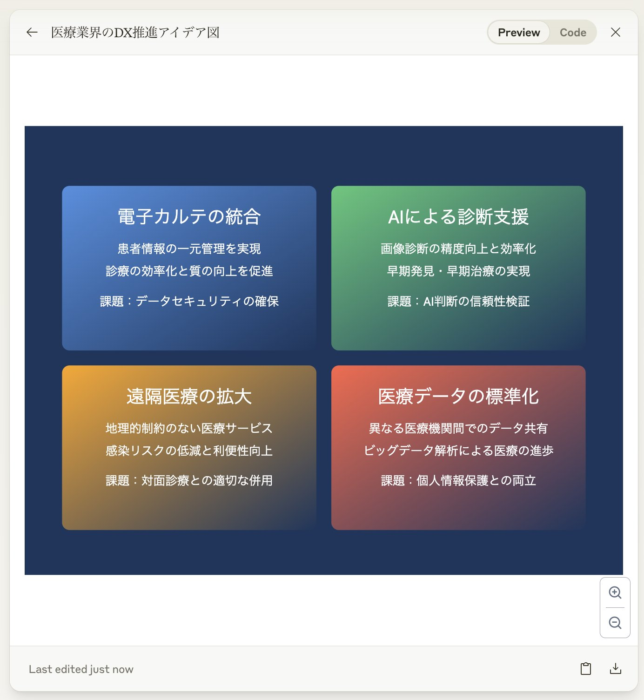

## brain storming sample

```markdown
BrainStorm: ∑(i=1 to 4) Idea_i([トピック]) → {MD + SVG_Code}
where:
Idea_i = {T, D(2), C(1)}
SVG_Code = GenerateSVG(Ideas, Layout, Style)
Layout = {S: 800x600, G: 2x2, Cd: 340x220, P: [(50,80),(410,80),(50,320),(410,320)]}
Style = {B: #1a365d, Gd: [g1,g2,g3,g4], F: white, A: center, Fs: [24,16]}
[トピック] = 医療業界のDX推進
lang:jp

## 記号の意味:
MD: Markdown説明
SVG_Code: SVG形式のコード
T: タイトル
D(2): 説明(2行)
C(1): 課題(1行)
S: サイズ
G: グリッド
Cd: カードサイズ
P: 位置
B: 背景色
Gd: グラデーション配列
F: フォント色
A: テキストアライメント
Fs: フォントサイズ配列 [タイトル, 本文]

## GenerateSVG関数の動作:
1. SVGの基本構造とビューボックスを設定
2. 背景色を適用
3. 各アイデアに対して:
   a. グラデーションを定義
   b. カードの長方形を描画
   c. タイトルとテキストを配置
4. 完全なSVGコードを返す

## グラデーション定義:
g1: #4a90e2 → #1a365d
g2: #50c878 → #1a365d
g3: #ffa500 → #1a365d
g4: #ff6347 → #1a365d
```

it shows the following image:

